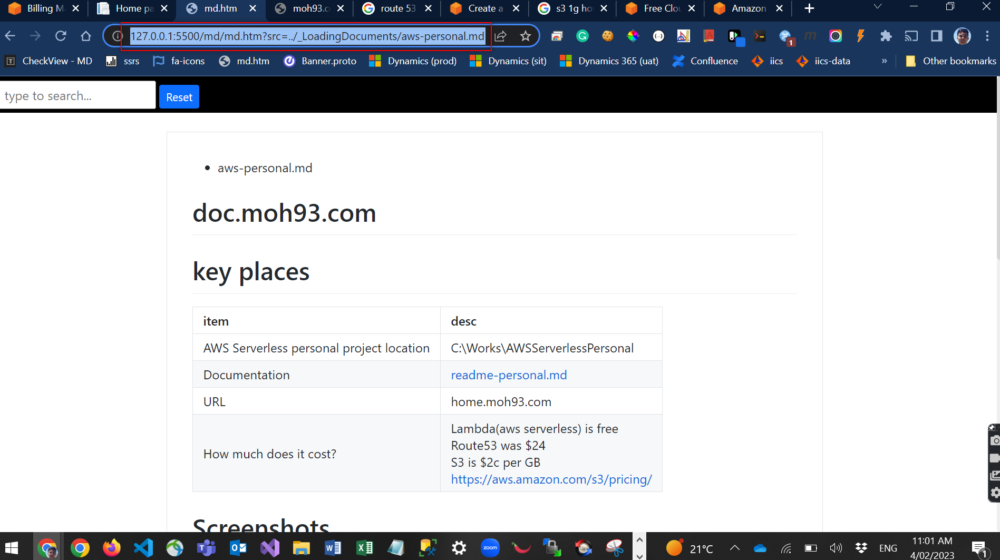

* `md` is markdown file extension.
* `md.htm` is a github project that embeds markdown file inside html.
* We can use `md.htm` to use javascript on top of `.md` file
* See also [implement-detail.md](./implement-detail.md)

# Photoswipe

* https://photoswipe.com/
* Source code: C:\Works\Photoswipe
* Test html file: [index.htm](../../PhotoSwipe-master/index.htm)

```
// This saved my life!
// https://stackoverflow.com/questions/14946200/use-photoswipe-on-dynamically-created-ul
// Photos += '<li><a href="' + this.src + '" data-pswp-width=1920 data-pswp-height=1080></a></li>';
// You need a physical tag exsiting already. In this case #mdcontainer
```

# key places
item|desc
--|--
This project started from|https://github.com/zhlicen/md.htm
How to use without param |http://127.0.0.1:5500/md/md.htm 
How to use with `src` param| http://127.0.0.1:5500/md/md.htm?src=../_LoadingDocuments/aws-personal.md
Code | C:\Works\md
github | https://github.com/oneman93/md

# file structure
item|desc
--|--
md.htm | main file with all `js` implementation
md-custom.css | * CSS for button etc <br>* Called from md.htm
md-custom.js | * Not used<br>* Intended to use for keyup event in search.<br>* Key up implemented in `md.htm` itself

# How to github

```
// Open C:/Works/md folder in vs code or
// cd /c/Works/md
git add .
git commit -m 'test'
git push
```

# Table of *.md file not rendering within md.htm

* 2022-12-06
* Not sure why markdown table is not rendering in this `md.htm`.
* I think elements should be inside `<zero-md/>` not `<zero-md-clone/>` to render table.

* `Expand` button is best-effort approach. When clicked, there could be all elements visible already. In other words, when all elements are showing, you still see `Expand` button.
* The other way, showing `Expand` button when any hidden `li` exists, was hard, because `li`'s parent `h1/h2` may not be visible, and showing `Expand` button there is not a good solution either.
    
# This project started from:
- https://github.com/zhlicen/md.htm
- https://github.com/zerodevx/zero-md
- https://github.com/markedjs/marked


# Backgournd

- I love documentation with markdown file (light-size, fast, stylish).
- Markdown file `*.md` can be embedded inside `*.html` file
- `zero-md` is one of them. 
- The html file, `md.htm` embeds `xxx.md` file passed by `?src=xxx.md` query string.
- [ref1] https://github.com/zhlicen/md.htm
- [ref2] https://zerodevx.github.io/zero-md/attributes-and-helpers/


# Implementation of md.htm
- c:\works\md.htm
- Other files:
- Folder `c:\works\md` has css file.
- md.htm has cdn url `zero-md` library parsing md file into html.
- I added bootstrap etc to make style
- Everything should be inside `window.load` because `md` file should be loaded into `html` first so that we can play with `jQuery`.
- As showdow-root-doms could not be accessed by jQuery, I do clone the dom elements of shadow-root and put it into `<zero-md-clone>`
- Every elements inside `<zero-md-clone>` can now be played with jQuery.

# How to run
- Open `md.htm` in `vs`
- Click `Go live`
- http://127.0.0.1:5500/md.htm
- 


# How to use md.htm in another machine, eg, mac

1. Copy md folder to mac. (only 2mb)
2. Open md/md.htm and edit
```
if (app.src == '') {
    app.src = '../_work_index.md';
}
```
3. Run vs code, go live
4. http://127.0.0.1:5500/md.htm

# ChangeBody

## Known bugs

* If `md` page does not have `<h1>` (a line starting with `#` symbol) tag first, it does not now on load.


