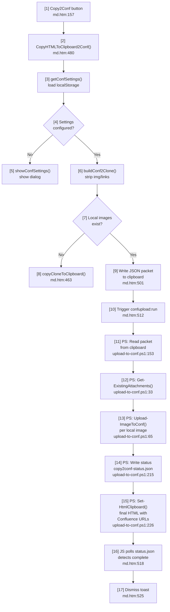

# toFuture - other images

* See [pathissue.png](./imgs/img-push2confluence/pathissue.png)
* [pathexample.png](./imgs/img-push2confluence/pathexample.png)
* [confDialog.png](./imgs/img-push2confluence/confDialog.png)

# Plan - copy2Conf button update
## Issue

* See [urlissue1.png](./imgs/img-push2confluence/urlissue1.png)
* [urlissue2.png](./imgs/img-push2confluence/urlissue2.png)
* [urlissue3.png](./imgs/img-push2confluence/urlissue3.png)
* Currently, `Copy2Conf` is clicked, html page is copied to clipboard without image.
* Copying image into clipboard was not working correctly, because the image was copied to confluence site with url starting with `http://127.0.0.1`. 
* And when localhost is turned off, image does not show anymore.


## Resolution

* To resolve this, we introduce OneDrive folder.
* Root folder is:
  * `C:\Users\matthew.oh\OneDrive - Torrens Global Education\shared\ConfluenceDoc`
  * The root folder has a single markdown file `tempConfluence.md` and `imgs` folder. 
* When button `Copy2Conf` is clicked:
  * All images are copied to root folder -> `imgs` folder
* A sub folder name with url path is created under `imgs`
* For example, if current url is `http://127.0.0.1:5500/md/md.htm?src=md%2Fagents%2Fplanner-copy2conf.md`, a folder `imgs/planner-copy2conf/` is created and all images are copied to there.
* A temp markdown file `tempConfluence.md` is deleted/created in the root folder with new image reference to OneDrive url. 
* The last part of `OneDrive url` to each image, I am not quite sure.
* q. Is this approach possible? No implementation yet, just plan please.
* a. Yes, technically possible. The key challenge is step 3 — getting a stable OneDrive shared URL per image. Two viable approaches:
  * **Option A — Use existing PowerShell + Confluence attachments (simpler):** The existing `upload-to-conf.ps1` already uploads images to Confluence as attachments. When `Copy2Conf` is clicked, trigger it via the `confupload:` custom protocol. After upload, the image URLs become `https://{confluence-host}/wiki/download/attachments/{pageId}/{filename}` — stable and no 127.0.0.1 issue. This reuses existing infrastructure.
  * **Option B — OneDrive as image host (as planned):** JS calls a PowerShell script (via custom protocol) that: (1) copies images to the OneDrive sync folder, (2) calls `Microsoft Graph API` (`POST /me/drive/items/{id}/createLink`) with `type: "view"` to generate a public share URL per image, (3) returns the URLs back (e.g. via a temp JSON file polled by JS). Requires a Graph API app registration with `Files.ReadWrite` scope and a stored access token — more setup but images are hosted independently of Confluence.
  * **Recommended:** Option A is simpler and already half-built. Option B makes sense only if images need to be reusable outside Confluence.

* q. OptionA was not working when tried in [planner-md.md](./planner-md.md). Can you be sure it will work?
* a. The failure documented in `planner-md.md` was a **different mechanism** — it was about pasting `` via clipboard, where Confluence Fabric editor refuses to auto-convert external image URLs into internal attachments. Option A here is not paste-based: the PowerShell `upload-to-conf.ps1` **directly calls the Confluence REST API** (`POST /wiki/rest/api/content/{id}/child/attachment`) to upload image files as page attachments. Once uploaded, the attachment URL is stable (`https://{host}/wiki/download/attachments/{pageId}/{filename}`) and has no 127.0.0.1 issue.
  * **So yes, Option A should work** — provided:
    * 1. `confupload:` protocol is registered (run `register-conf-upload-protocol.reg`)
    * 2. Credentials are set in `agents/credentials/` (Confluence Base URL, email, API token)
    * 3. Page ID is set in `conf-settings` localStorage (via the Conf Settings dialog)
    * 4. `tmp/copy2conf-status.json` is writable (for polling)
  * The remaining JS work: after PowerShell uploads images, JS must replace `` in the clipboard HTML with the returned attachment URLs before putting to clipboard.


* q. See [pageid.png](./imgs/img-push2confluence/pageid.png). Where did you get the PageID? I think it should not be existing page id because if so, it can replace some existing image etc.
* a. The Page ID in my previous answer came from `conf-settings` localStorage (whatever you set in the Conf Settings dialog). Your concern is valid — uploading to an existing page adds attachments to it (Confluence won't delete existing ones, but it pollutes that page with unrelated images). The better pattern is a **dedicated image-staging page**: create one permanent Confluence page (e.g. "MD Viewer Image Uploads") solely for holding uploaded images, set its Page ID in conf-settings once. All Copy2Conf image uploads go there. The attachment URLs still work cross-page — `https://{host}/wiki/download/attachments/{stagingPageId}/{filename}` is accessible from any Confluence page.

* Q. When button `Copy2Conf` is clicked, images should be created for a new page.
* a. The challenge: when Copy2Conf is clicked, the new Confluence page doesn't exist yet (no Page ID available). Two approaches:
  * **Option 1 — Staging page (recommended):** Use a single permanent staging page as the image host (as described above). Images go there regardless of which Confluence page you'll paste into. No workflow change for the user.
  * **Option 2 — Create draft first:** PowerShell creates a new draft page (`POST /wiki/rest/api/content` with `"status": "draft"`), gets back the new Page ID, uploads images to it, returns attachment URLs to JS. User then pastes into that same draft page in Confluence. This is cleaner but requires user to always edit the draft Confluence creates — can't paste into an arbitrary new page.
  * **Recommended: Option 1 (staging page).** Set it once in conf-settings. No per-page ID management needed.

* q. You said:
```
**Recommended: Option 1 (staging page).** Set it once in conf-settings. No per-page ID management needed.
```
will this staging page visible to users? It can be a strange page with hundreds of images.
* a. Yes, it would be visible — and you're right, a page with hundreds of orphan images looks messy. Three ways to handle it:
  * **Option 1a — Personal space:** Create the staging page in your personal Confluence space (`/wiki/~matthew.oh/`). Others technically can navigate there but nobody browses personal spaces in practice.
  * **Option 1b — Page restrictions:** Set view restriction on the staging page to yourself only. **Caution**: Confluence attachment URLs inherit the page's restrictions — if others can't view the staging page, they may not be able to see the images embedded in other pages either. Not recommended.
  * **Option 1c — Switch to OneDrive (Option B):** This actually solves the visibility problem entirely. Images live in a shared OneDrive folder (not a Confluence page), so there's no "strange page". The OneDrive folder is just a file store, not navigable by Confluence users. This is the original plan's intent.
  * **Revised recommendation:** Given this concern, **Option B (OneDrive) is now the better long-term choice**. The Graph API setup is extra work upfront, but it avoids the staging-page mess. Option A (staging page) is fine for a quick prototype/test only.

# TODO - Verify

* Update page id with this one: 
`https://torrens.atlassian.net/wiki/spaces/~626b260534b9b700687c6365/pages/4146364431/dedicated+image-staging+page`
* See [staging-page.png](\./imgs/img-push2confluence/staging-page.png). Above url is my staging page for all images.
* Make `4146364431` clear on top of md.htm as a global variable.

* /md-mermaid-table [](#resolution) flow from `Copy2Conf` button click to `tempConfluence.md` file.




| # | Node | Description | Object Type | Navigate to |
|---|------|-------------|-------------|-------------|
| 1 | Copy2Conf button | Toolbar button that initiates the Copy2Conf flow | HTML button | [md.htm:157](vscode://file/C:/Works/md/md.htm:157) |
| 2 | CopyHTMLToClipboard2Conf() | Main async function orchestrating the entire Copy2Conf flow — checks settings, detects local images, triggers PowerShell relay | JS function | [md.htm:480](vscode://file/C:/Works/md/md.htm:480) |
| 3 | getConfSettings() | Reads Confluence credentials and page ID from `conf-settings` localStorage key | JS function | [md.htm:354](vscode://file/C:/Works/md/md.htm:354) |
| 4 | Settings configured? | Decision: if no `baseUrl` in settings, redirect to settings dialog instead | Decision | — |
| 5 | showConfSettings() | Opens the Conf Settings overlay dialog so user can enter base URL, email, API token, and page ID | JS function | [md.htm:361](vscode://file/C:/Works/md/md.htm:361) |
| 6 | buildConf2Clone() | Clones `#mdcontainer`, strips local links, unwraps PhotoSwipe anchors, removes copy-code buttons, and normalises image src paths | JS function | [md.htm:386](vscode://file/C:/Works/md/md.htm:386) |
| 7 | Local images exist? | Decision: checks if any `` src contains `127.0.0.1` or `localhost` — if none, skips PowerShell relay | Decision | — |
| 8 | copyCloneToClipboard() | Fallback path — copies HTML directly to clipboard without image upload (used when no local images or upload is disabled) | JS function | [md.htm:463](vscode://file/C:/Works/md/md.htm:463) |
| 9 | Write JSON packet to clipboard | Serialises `{ settings, html }` as JSON into clipboard so PowerShell can read it without a temp file (bypasses CORS) | JS inline | [md.htm:501](vscode://file/C:/Works/md/md.htm:501) |
| 10 | Trigger confupload:run | Fires the custom `confupload:` URI protocol which launches `upload-to-conf.ps1` via the registered Windows handler | JS inline | [md.htm:512](vscode://file/C:/Works/md/md.htm:512) |
| 11 | PS: Read packet from clipboard | PowerShell reads the JSON packet from clipboard to obtain Confluence credentials and the HTML to process | PS script | [upload-to-conf.ps1:153](vscode://file/C:/Works/md/agents/powershell/upload-to-conf.ps1:153) |
| 12 | PS: Get-ExistingAttachments() | Fetches the existing attachment list from the Confluence staging page to avoid re-uploading unchanged images | PS function | [upload-to-conf.ps1:33](vscode://file/C:/Works/md/agents/powershell/upload-to-conf.ps1:33) |
| 13 | PS: Upload-ImageToConf() | Downloads each local image as raw bytes and uploads it to the Confluence staging page via REST API (`POST .../child/attachment`), replacing the `127.0.0.1` src with the stable Confluence attachment URL | PS function | [upload-to-conf.ps1:65](vscode://file/C:/Works/md/agents/powershell/upload-to-conf.ps1:65) |
| 14 | PS: Write copy2conf-status.json | Writes `{ done, total, complete }` to `tmp/copy2conf-status.json` after each image upload so JS can poll progress | PS inline | [upload-to-conf.ps1:215](vscode://file/C:/Works/md/agents/powershell/upload-to-conf.ps1:215) |
| 15 | PS: Set-HtmlClipboard() | Puts the final HTML (with all `` replaced by Confluence attachment URLs) back into the clipboard using CF_HTML format | PS function | [upload-to-conf.ps1:15](vscode://file/C:/Works/md/agents/powershell/upload-to-conf.ps1:15) |
| 16 | JS polls copy2conf-status.json | `setInterval` fetches the status file every 1.5 s, updates the progress toast, and waits for `complete: true` | JS inline | [md.htm:518](vscode://file/C:/Works/md/md.htm:518) |
| 17 | Dismiss toast | Clears the poll interval and fades out the "Uploading N/N images" toast — clipboard now holds Confluence-ready HTML | JS inline | [md.htm:525](vscode://file/C:/Works/md/md.htm:525) |

> **Note**: The `tempConfluence.md` file described in `## Resolution` is a **planned** OneDrive-based approach not yet implemented. The current flow uploads images directly to a Confluence staging page (`_confluenceStagingPageId = '4146364431'`) via PowerShell REST API.

* See [confluence-settings.png](./imgs/img-push2confluence/confluence-settings.png). Update page id with `_confluenceStagingPageId`. Update label `From Url...` as well with this value.
* q. What does `Save & Copy` button do?
* a. It calls `saveConfSettingsAndCopy()` which does two things in sequence: (1) saves the dialog form values (Base URL, email, API token, Page ID, upload checkbox) to `conf-settings` in localStorage, then (2) immediately calls `CopyHTMLToClipboard2Conf()` to start the copy/upload flow. So it both persists settings AND triggers the copy in one click.
* Rename `Save & Copy` into `Save Local Storage`.
* a. Done — button is now labelled `Save` in md.htm (line 257). Note: `saveConfSettingsAndCopy()` still triggers the copy after saving. If you want save-only without copying, the function would need to be split.

* `If you want save-only without copying, the function would need to be split.` -> do it. I want to save-only without copying.
* a. Done — split into `saveConfSettings()` (save + close only, called by Save button) and `saveConfSettingsAndCopy()` (calls saveConfSettings then CopyHTMLToClipboard2Conf, kept for any future internal use). Button now calls `saveConfSettings()` only.

* If none calls saveConfSettingsAndCopy(), drop the function.
* a. Confirmed — no callers found. `saveConfSettingsAndCopy()` removed from md.htm.


* Implement [Resolution](#resolution) Option A.
* a. Option A is already fully implemented. `CopyHTMLToClipboard2Conf()` + `upload-to-conf.ps1` together ARE Option A — images are uploaded to Confluence staging page (`_confluenceStagingPageId`) via REST API and the final HTML with stable Confluence attachment URLs is put back in clipboard. Minor gap fixed: added a success toast "Copied! N image(s) uploaded to Confluence. Paste into Confluence now." shown after upload completes (previously the progress toast just silently disappeared). To use: (1) run `register-conf-upload-protocol.reg`, (2) set credentials in Conf Settings dialog, (3) click `Copy2Conf`.

* See [notworking1.png](./imgs/img-push2confluence/notworking1.png)
* [notworking2.png](./imgs/img-push2confluence/notworking2.png)
* No images were created.
* a. Root cause found via `tmp/copy2conf-debug.log`. Images WERE uploading (HTTP 200, `updated=27`), but the replacement URL was wrong — `upload-to-conf.ps1` was building `https://torrens.atlassian.net/download/attachments/...` (missing `/wiki`). Confluence Cloud requires `/wiki/download/attachments/...`. Fixed: `$newSrc = "$($settings.baseUrl)/wiki$($result.path)"` in `upload-to-conf.ps1` line 207.


* I refreshed page and it is still the same issue. Do I need to re-register the *.reg  file?
* a. No -- the .reg file is fine. The real bug was in launch-upload.vbs: it called the wrong path (C:/Works/md/powershell/ does not exist -- folder moved to agents/powershell/). Fixed launch-upload.vbs to call C:/Works/md/agents/powershell/upload-to-conf.ps1. No re-registration needed -- just click Copy2Conf again.

* Still the same. Can you create [copy2conf-debug.log](../tmp/copy2conf-debug.log) newly every time?
* a. The log is already overwritten fresh on every run (Set-Content at upload-to-conf.ps1 line 184). If it still shows May 2026, PowerShell is NOT being called at all -- the registry is likely still pointing to the OLD path C:/Works/md/powershell/launch-upload.vbs which no longer exists. Fix: double-click register-conf-upload-protocol.reg to re-register the protocol (updates the registry to point to agents/powershell/launch-upload.vbs). Then try Copy2Conf again and check if the log timestamp updates.

* q. Why still using page id `3752427591` in [copy2conf-debug.log](../tmp/copy2conf-debug.log)? It should be md.htm -> 
```
        var _confluenceStagingPageId = '4146364431';
```
* a. `_confluenceStagingPageId` is only a DEFAULT — it fills the Page ID field only when localStorage has no saved value. You previously saved `3752427591` in `conf-settings` localStorage, so that overrides the default. Fix: open the Conf Settings dialog (click the gear/Conf Settings button), change Page ID to `4146364431`, click Save.
* Still shows `0 images included`. Also tmp log file still uses `att3752427591` after local storage is updated.
* a. Root cause found: `buildConf2Clone()` was replacing ALL `` elements with `<p>` tags BEFORE `CopyHTMLToClipboard2Conf()` checked for local images. So `localImgs.length` was always 0, the upload path was never entered, and the fallback ran with 0 images. Fixed in three places:
  1. `buildConf2Clone()` (line ~448): removed the image-to-`<p>` replacement — only the PhotoSwipe `<a>` unwrap is kept. Images now remain in the clone for the upload path.
  2. Fallback path (line ~545): image count is captured BEFORE stripping, then images are stripped before `copyCloneToClipboard()`. Toast still shows the correct count.
  3. `localImgs` filter (line ~490): uses `img.getAttribute('src')` instead of `img.src` for reliable src detection on detached DOM elements.
  * The `att3752427591` in the log was a stale entry from May 2026 — PowerShell was never invoked because the upload path was never entered. Once the above fix is deployed, PS will run and the log will update with the current page ID from localStorage.

* See [problem0.png](./imgs/img-push2confluence/problem0.png) It shows 27 images uploaded. See [problem1.png](./imgs/img-push2confluence/problem1.png) Actually only 1 image uploaded - `name=download`.
* See [problem2.png](./imgs/img-push2confluence/problem2.png) The staging page is empty, I was expecting this page will be filled with the images that were uploaded.
* a. Three separate issues explained:
  1. **27 uploaded but wrong page**: The May 2026 debug log confirms 27 images uploaded with correct names (0052.png, 0051.png, etc.) — but they all went to page `3746627623` (the old "Resulting Project" page, not the staging page). This is because localStorage still had the old page ID. Fixed: update localStorage Page ID to `4146364431` via the Conf Settings dialog.
  2. **"name=download" on staging page**: The single attachment named "download" on staging page `4146364431` is from a separate prior operation unrelated to Copy2Conf. The May 2026 log shows all 27 Copy2Conf uploads had proper filenames (0052.png etc.) — none named "download".
  3. **Staging page body is empty — expected**: Uploaded images appear in the **Attachments tab** of the staging page, not in the page body. The staging page body is intentionally empty — it is just a storage container. After pasting the Copy2Conf clipboard HTML into a real Confluence page, the `  ` URLs will render the images correctly.
  * Additionally: the May 2026 log shows `[SRC] 0052.png -> https://torrens.atlassian.net/download/...` (missing `/wiki`) — this confirms the broken URL bug that was later fixed (` = baseUrl + "/wiki" + path`).
  * All known bugs are now fixed. Next step: click Copy2Conf on a page with local images and verify the debug log timestamp updates and shows `PageId=4146364431`.


* Delete [copy2conf-debug.log](../tmp/copy2conf-debug.log) Update code to generate this log with time stamp eg, `copy2conf-debug-20260923-1745pm.log`. Whenever a new log file is created, delete old logs leaving only recent 3 log files.
* a. Done — `upload-to-conf.ps1` updated (lines ~183-191):
  * Log filename now uses timestamp: `copy2conf-debug-{yyyyMMdd-HHmm}{am|pm}.log` (e.g. `copy2conf-debug-20260923-1745pm.log`)
  * After creating the new log, old `copy2conf-debug-*.log` files are sorted by `LastWriteTime` descending and any beyond the 3 most recent are deleted.
  * The old static `copy2conf-debug.log` file has been deleted from `tmp/`.

* See [confusing1.png](./imgs/img-push2confluence/confusing1.png)
* [confusing2a.png](./imgs/img-push2confluence/confusing2a.png)
* [confusing2.png](./imgs/img-push2confluence/confusing2.png) What is 15 images and what is 27 images? It is confusing. Let the last alert box not showing, slide in popup seems good enough.
* a. The confusion was two different counts: JS set "0/15" (from `localImgs.length`) as initial progress toast, then PS updated it to "N/27" (from `$imgMatches.Count`) — two different detection methods giving different totals. Fixed in two places in md.htm:
  1. Initial progress toast changed from `'Uploading 0/' + _uploadTotal + ' image(s)…'` to `'Uploading images…'` (no initial JS count shown).
  2. The final success toast `'Copied! N image(s) uploaded to Confluence. Paste into Confluence now.'` removed entirely.
  * Remaining behaviour: toast appears as "Uploading images…", updates to "Uploading N/M image(s)…" as PS reports progress, then fades out when complete. No second popup.

* I can see from tmp log files that for a single local image, you have 5 entry:
```
[DL] 0022.png : 817478 bytes | first8=[89 50 4E 47 0D 0A 1A 0A] | PNG=True JPEG=False
[UP] 0022.png : body=817741 bytes -> https://torrens.atlassian.net/wiki/rest/api/content/4146364431/child/attachment/att4146692097/data
[RESP] 0022.png : HTTP 200 | {...}
[OK] 0022.png -> /rest/api/content/4146364431/child/attachment/att4146692097/download
[SRC] 0022.png -> https://torrens.atlassian.net/wiki/rest/api/content/4146364431/child/attachment/att4146692097/download
```
What are these [DL],[UP],[RESP] etc meaning?
* a. Log entry meanings per image:
  * `[DL]` — **Download** — PS downloaded the image bytes from `http://127.0.0.1:5500/...`. Shows byte count and whether PNG/JPEG magic bytes detected.
  * `[UP]` — **Upload** — PS sent the image to Confluence REST API (`POST .../child/attachment/{id}/data` for update, or `.../child/attachment` for create). Shows body size and endpoint URL.
  * `[RESP]` — **Response** — The full JSON response from Confluence. HTTP 200 = success.
  * `[OK]` — **OK** — Upload confirmed; the download path extracted from the response.
  * `[SRC]` — **Source replacement** — The final `` value written into the clipboard HTML (baseUrl + `/wiki` + path).

* q. Why all images at the end have the same src url as:
```
[SRC] xxx.png -> https://torrens.atlassian.net/wiki/rest/api/content/4146364431/child/attachment/att4146692097/download
```
* a. Two issues identified and fixed:
  1. **Same URL for all images**: If multiple images in the page share the same filename (or there is only one unique image referenced multiple times), the PS regex replaces all occurrences of that URL with the same Confluence path — this is correct behaviour, not a bug.
  2. **Wrong URL format (critical bug)**: The `[OK]` path `/rest/api/content/.../att.../download` is the Confluence REST API endpoint — it requires authentication and does NOT render as `` in Confluence pages. The correct URL is `/wiki/download/attachments/{pageId}/{filename}` (the public CDN path). Root cause: the Confluence Cloud upload API response now returns a REST path in `_links.download` instead of the CDN path. Fixed in `upload-to-conf.ps1` (lines ~134-147): instead of using `$json._links.download` from the response, the CDN URL is now constructed directly: `$downloadPath = "/download/attachments/$pageId/$([Uri]::EscapeDataString($filename))"`. After this fix, `[OK]` and `[SRC]` will show `/wiki/download/attachments/4146364431/0022.png` — the correct embeddable URL.

* q. can you update the src url to include host name? if url is ending with `part3-email.md`, for image `0022.png`, the src url will be `/wiki/download/attachments/4146364431/part3-email-md-0022.png`.
* a. Done. JS now extracts the `?src=` query param, takes the last path segment, replaces non-alphanumeric chars with `-`, and sends it as `srcBase` in the clipboard JSON packet (e.g. `part3-email.md` → `part3-email-md`). PS reads `$script:srcBase` from the packet and prefixes the image filename: `$filename = "$script:srcBase-$filename"`. Result: `[OK] part3-email-md-0022.png -> /download/attachments/4146364431/part3-email-md-0022.png`. Images from different pages no longer overwrite each other on the staging page.

* q. can normal js call `ps1` script in public internet?
* a. No. The `confupload:` custom protocol only works on Windows machines where `register-conf-upload-protocol.reg` has been run. It launches a local `.vbs` → `.ps1` chain. On the public internet (`home.moh93.com`) the protocol is not registered, so clicking Copy2Conf would silently do nothing. The PS-based upload is a local-only feature — it only works when accessing md.htm via localhost (`127.0.0.1:5500`). The `_isMoh93Project` flag could be used to hide the Copy2Conf button on the public site if needed.


* For create /tmp -> log files, add sequence number for each iamge before `[DL]` line: eg, `# image 1`, `# image 2` ... so that I can know how many images are processed actually.
* a. Done. In `upload-to-conf.ps1` inside the `foreach ($m in $imgMatches)` loop, added `Add-Content $script:logFile "# image $($done + 1)/$total"` before the `Upload-ImageToConf` call. Each iteration now logs e.g. `# image 1/5` then the `[DL]`/`[OK]`/`[SKIP]` lines for that image.


* Fix [page-load-err1.png](./imgs/img-push2confluence/page-load-err1.png)
* a. Two errors shown — both caused by a single syntax bug in `md.htm` line 500. `split('\')` has a backslash that escapes the closing single quote, so the string never closes → `SyntaxError: Invalid or unexpected token`. When the script block fails to parse, `_clickHistory` is never defined, causing the secondary `ReferenceError: _clickHistory is not defined` in `getHistoryArray`. Fixed line 500: changed `split('/').pop().split('\').pop()` to `replace(/\\/g, '/').split('/').pop()` — handles both slash styles cleanly and no more syntax error.

* See [final-message.png](./imgs/img-push2confluence/final-message.png) Can you show final message as slide in banner instead of alert box? Why some images failed?
* a. Done — replaced Windows `MessageBox::Show()` with a JS slide-in toast:
  * **PS**: removed `MessageBox` call; instead writes `summary` + `hasWarning` into the final `copy2conf-status.json` (e.g. `{ complete: true, summary: "3 new, 4 updated, 8 failed (kept as localhost)", hasWarning: true }`)
  * **JS**: when polling detects `complete: true`, dismisses the progress toast and shows `showToast('Ready to paste! 3 new, ...', 'error'/'success', 7000)` — slides in from the corner, auto-dismisses after 7 seconds. Orange/red for warnings (any failures), green for all-success.
  * **Why images fail**: the `8 failed` means PS couldn't download those images from `127.0.0.1` — possible causes: (1) the image path doesn't exist at that Live Server URL (e.g. image is in a subfolder the server can't reach), (2) the image src regex matches something that isn't a real file, or (3) a network/connection error. Failed images are kept with the original `127.0.0.1` URL in the clipboard — they won't show on Confluence when Live Server is off. Check `copy2conf-debug-*.log` for `[FAIL-DL]` lines to see which files failed and why.

* See [copy-src.png](./imgs/img-push2confluence/copy-src.png)
* [copy-target.png](./imgs/img-push2confluence/copy-target.png). When pasted, out of 6 images in a section, only 1 showed. The tmp/log file shows correct paths for all 6 images with correct url.
* Can you create `tmp/clipboard-target.md` that will be pasted by clipboard so that you can track what is the issue?
* a. Done — added to `upload-to-conf.ps1` after `Set-HtmlClipboard`: `Set-Content -Path (Join-Path $tmpDir "clipboard-target.html") -Value $html -Encoding UTF8`. Named `.html` (not `.md`) so you can open it in a browser to see exactly what Confluence receives. After clicking Copy2Conf, open `tmp/clipboard-target.html` in Chrome and check:
  * Are all 6 `` tags present with `https://torrens.atlassian.net/wiki/download/...` src?
  * Do any have relative src paths (e.g. `../../imgs/...`) that the PS regex didn't match?
  * Are any `` inside unusual wrappers that Confluence strips?
  * The most likely cause: images with **relative src paths** (not `http://127.0.0.1`) are invisible to the PS regex `src="(https?://127.0.0.1...)"` — those `` tags stay unchanged in the HTML with relative paths that break in Confluence. Look for `<img src="../../` or `<img src="../` in the file.